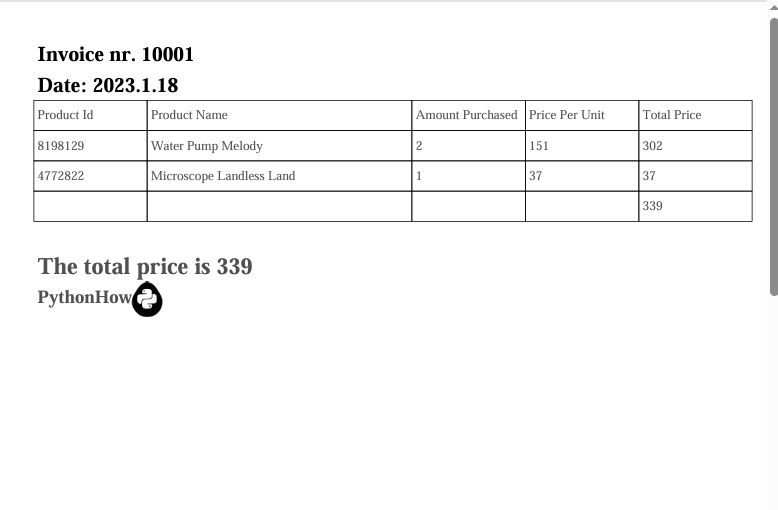

📄 Conversor de Faturas Excel para PDF  
  
Este projeto em Python automatiza a conversão de faturas no formato Excel (.xlsx) em arquivos PDF formatados.  
Ele lê os dados das faturas, organiza em uma tabela no PDF e adiciona informações como número da fatura, data e total.  

🛠️ Tecnologias Utilizadas  
  
🐍 Python  
📊 Pandas — Leitura e manipulação de dados em Excel.  
📄 FPDF — Criação de arquivos PDF.  
📂 Glob — Busca de arquivos no sistema de diretórios.  
📂 Pathlib — Manipulação de caminhos de arquivos.   
  
🔧 Como Funciona  
  
O script realiza os seguintes passos:  
  
1. Varre a pasta invoices/ buscando todos os arquivos .xlsx.  
2. Para cada arquivo encontrado:  
3. Extrai o número da fatura e a data a partir do nome do arquivo.  
4. Cria um novo documento PDF.  
5. Adiciona o cabeçalho com o número da fatura e a data.  
6. Lê os dados da planilha e monta uma tabela no PDF.  
7. Calcula o total da fatura e exibe tanto na tabela quanto em destaque no final.  
8. Insere uma assinatura e uma logo no rodapé.  
9. Salva o PDF gerado na pasta PDFs/.  
  
📌 Exemplo de PDF Gerado  
  

